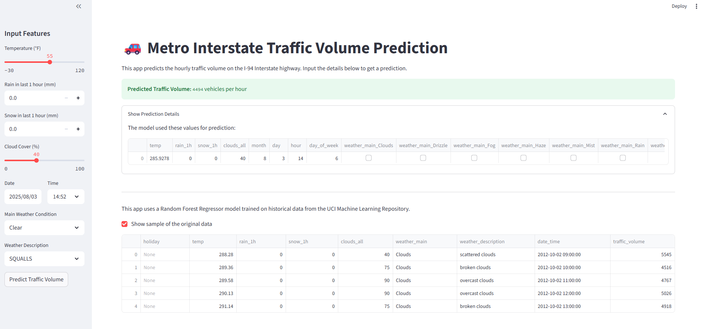

# 🚗 Traffic Volume Prediction using Machine Learning & Streamlit

This project predicts the hourly traffic volume on the I-94 Interstate highway using various features like weather conditions, time of day, and holidays. The prediction is delivered through an interactive web application built with Streamlit.

## Overview

The goal of this project is to build a reliable machine learning model to forecast traffic flow. This can be useful for traffic management, urban planning, and for commuters planning their trips.

The project consists of two main parts:
1.  A Python script (`traffic_prediction_model.py`) that cleans the data, engineers features, and trains a Random Forest Regressor model.
2.  A Streamlit application (`app.py`) that loads the pre-trained model and provides a user-friendly interface for making real-time predictions.

## Screenshot of the App




## Features

-   **Interactive UI:** Clean and simple user interface powered by Streamlit.
-   **Feature Input:** Allows users to input features like temperature, weather conditions, date, and time.
-   **Real-time Prediction:** Delivers an instant prediction of the traffic volume based on the inputs.
-   **Data-Driven:** Uses the "Metro Interstate Traffic Volume" dataset from the UCI Machine Learning Repository.
-   **Reproducible:** The model training script is included, allowing anyone to retrain the model.

## Technologies Used

-   **Python:** The core programming language.
-   **Pandas:** For data manipulation and analysis.
-   **Scikit-learn:** For building and evaluating the machine learning model (Random Forest Regressor).
-   **Streamlit:** To create the interactive web application.
-   **Joblib:** For saving and loading the trained model.
-   **Seaborn & Matplotlib:** For data visualization during the exploration phase.

## Setup and Installation

To run this project on your local machine, follow these steps:

**1. Clone the repository:**
```bash
git clone [https://github.com/PAVANKUMARELETI/traffic-prediction-streamlit-app.git](https://github.com/PAVANKUMARELETI/traffic-prediction-streamlit-app.git)
cd traffic-prediction-streamlit-app
```


**2. Create and activate a virtual environment:**
```bash
# Create the environment
python -m venv venv

# Activate on Windows
venv\Scripts\activate

# Activate on macOS/Linux
source venv/bin/activate
```

**3. Install the required dependencies:**
```bash
pip install -r requirements.txt
```

## How to Use the Project

**Step 1: Train the Model**

First, you need to run the training script. This will process the dataset and save the trained model file (`random_forest_model.pkl`) inside a new `models` directory.

```bash
python traffic_prediction_model.py
```

**Step 2: Run the Streamlit App**

Once the model is trained and saved, you can launch the web application.

```bash
streamlit run app.py
```
Your default web browser will open with the app running. Use the sidebar to input your desired features and click "Predict Traffic Volume" to see the result.

## Project Structure

```
traffic-prediction-streamlit-app/
├── .gitignore
├── Metro_Interstate_Traffic_Volume.csv
├── README.md
├── app.py
├── models/
│   ├── random_forest_model.pkl
│   └── training_columns.pkl
├── requirements.txt
└── traffic_prediction_model.py
```

## Data Source

This project uses the **Metro Interstate Traffic Volume Dataset** provided by the UCI Machine Learning Repository.

-   **Citation:** John Hogue, Traffic Data, University of California, Irvine, 2019
-   **Link:** [UCI Machine Learning Repository](https://archive.ics.uci.edu/ml/datasets/Metro+Interstate+Traffic+Volume)